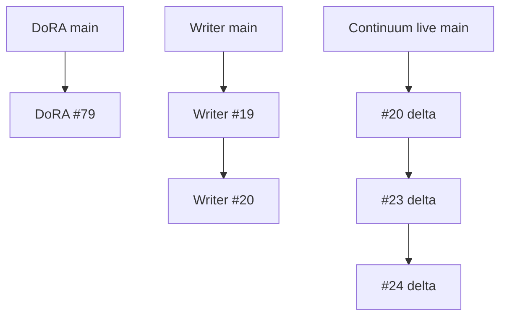
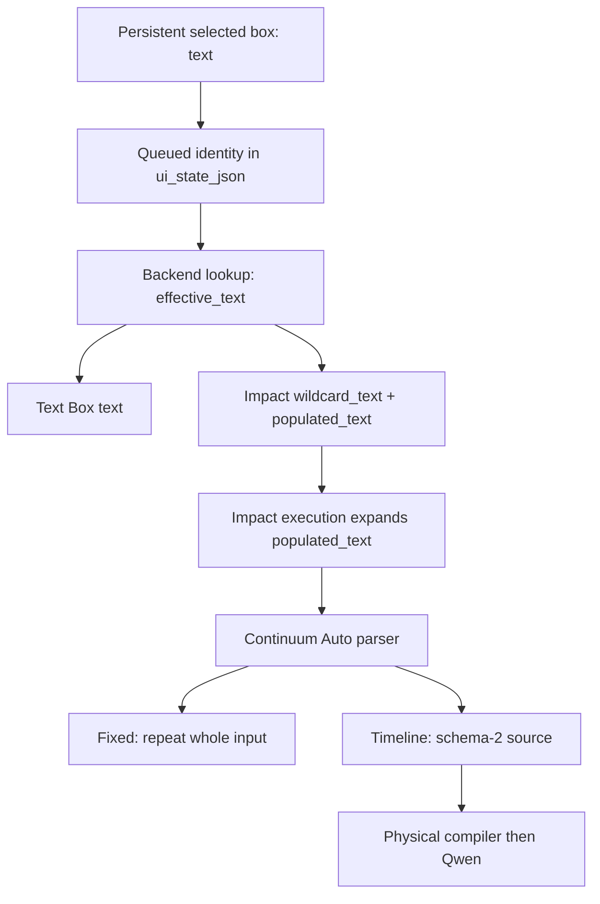

# State Manager → Impact → H3 Continuum prompt transport

Status: implementation-ready design; production changes and workstation validation are pending.
Source audit: 2026-09-19.

Evidence labels: **V** verified source/runtime fact; **D** design decision;
**A** installation assumption; **U** unresolved evidence.

## 1. Scope and non-goals

Make direct State Manager → State Manager Text Box → ImpactWildcardProcessor →
H3 Continuum preserve deliberately authored chunk boundaries. Prompt Writer is
optional and becomes another producer of the same persistent document. Preserve
intentional Fixed prompts, legacy List behavior, identity-v2 selection,
revision-protected writes, Impact seeds/modes, and the separate Continuum First
Frame, physical text and audio layers.

Specify persistence, intent, snapshots, ordering, consumer validation, receipts,
tests and rollout. Do not infer timing from prose, implement the production fix
in this investigation, redesign attention/sampling or enable physical Timeline
Video. No GPU-quality or performance claim follows from this design.

## 2. Live repository/runtime provenance

All six PRs were fetched with metadata, changed files, submitted reviews, review
threads, discussion comments and head check runs. All remain open and mergeable.
Continuum PRs are drafts; DoRA/Writer PRs are not drafts. No submitted reviews or
inline review threads were returned. Discussion comments reported CodeRabbit
review skipping. A successful CodeRabbit status is not a code review. Returned
head check runs were successful for all six PRs.

| Repository (xmarre/) | PR | Base SHA | Head SHA | Head branch |
|---|---|---|---|---|
| ComfyUI-DoRA-Dynamic-LoRA-Loader | 79 | c91612008a4979b412b8bc49d5ffd7e6bef7be10 | 6c1ce0c6d812f854048dc19529163f71d68e186b | mirror/state-manager-prompt-writer-integration-20260918 |
| ComfyUI-MiniMaxH3-Prompt-Writer-Plus | 19 | 5694fdf195c93a5e4341389fc6b36c66b6c24568 | 74e3b66c0bba238f3213a216b0f9f06a5c5ebfd2 | upstream/continuum-suite |
| ComfyUI-MiniMaxH3-Prompt-Writer-Plus | 20 | 74e3b66c0bba238f3213a216b0f9f06a5c5ebfd2 | 1152064cb622fc2df6a886622225bf1936ed2a82 | fix/00514-continuum-state-manager-prompt-handoff |
| ComfyUI-H3-Continuum-Plus | 20 | bf25353d8bec44afea22c89717c4301ce13c2036 | ccf50cddf83124707b866e4df3956e85d41dda4b | fix/first-frame-continuation-presentation |
| ComfyUI-H3-Continuum-Plus | 23 | ccf50cddf83124707b866e4df3956e85d41dda4b | eb197769ff856bc5d0768cfdaa6017c127741ced | mirror/production-physical-text-transport-20260913 |
| ComfyUI-H3-Continuum-Plus | 24 | eb197769ff856bc5d0768cfdaa6017c127741ced | e9f8006e4d2d3a2381d26b6dfacf04f90da84416 | mirror/production-phase-aware-audio-20260913 |

DoRA main equals #79's base; Writer main equals #19's base. **V:** Continuum main
advanced to a5b8943844594545301b20d01af5d9e3fa38ae29, a repository-reference
rename after bf25353. It changes README.md, README_JA.md and pyproject.toml.
An isolated Git index applied main + #20 base→head delta + #23 delta + #24 delta
without conflicts, yielding tree fb1fde1408b09efbf5214168ef3083173f09163d.
Its only differences from #24 are those three rename files. Relevant Python
runtime source equals the audited #24 source. This reconstructs the specified
overlays; it does not prove every file installed by Patcher.



Representative hosted runs:
[DoRA 35406076181](https://github.com/xmarre/ComfyUI-DoRA-Dynamic-LoRA-Loader/actions/runs/35406076181),
[Writer 35406082759](https://github.com/xmarre/ComfyUI-MiniMaxH3-Prompt-Writer-Plus/actions/runs/35406082759),
[Continuum #23 35378222063](https://github.com/xmarre/ComfyUI-H3-Continuum-Plus/actions/runs/35378222063),
[Continuum #24 35378268000](https://github.com/xmarre/ComfyUI-H3-Continuum-Plus/actions/runs/35378268000).
These are structural checks, not proof of production content isolation.

The failing log reports ComfyUI v0.36.0-16-gacbf3eb1 on patcher/stack,
Impact 8.28.3, State Manager v4 / identity-v2 / backend-write-v1 and enabled
physical text transport. Audited upstream Impact main:
429d0159ad429e64d2b3916e6e7be9c22d025c3c, also 8.28.3.
Audited ComfyUI server.py at v0.36.0 has blob
ac8719110887b2e53d9a0462f8d81f92a7d46f26.
**U:** installed Impact/server file bytes and handler registration order were not
available. Matching package versions does not establish installed-source parity.

Continuum AGENTS.md requires malformed/unknown prompt syntax to pass through as
diagnostic Fixed fallback, prohibits new prompt-content execution stops and
preserves compact V3.4 UI. No AGENTS.md was found in audited DoRA/Writer trees.
This design adds no prompt-content stop. Existing persistence schema/revision
errors retain write-integrity protections.

## 3. Verified facts and evidence

### Runtime failure

The complete available text of Pasted text(20260918-235532).txt was inspected.
Sanitized decisive fields:

```text
managed prompt API contract=v4 revision=backend-write-v1
Impact bridge revision=identity-v2 contract=v4 frontend_contract=4
selection_source=queue_metadata queued_match=True
mode='reproduce' chars=1023 timeline=False
raw_text_sha256=d710bc9109dd8dbc4c98f9c825023703d82bef6acb593d7a71e820df042dc680
PT209 requested_mode='Auto' resolved_mode='Fixed — one prompt'
source_kind=fixed physical_compiler_enabled=True physical_compiler_eligible=False
source_digest=04d132997fbb6bf941455c1a15c8b12620d03c2fd4fd174b7a8a74a4a0f28d0e
```

No PT208/physical-compiler-active receipt occurs. Repeated text_length=3143 is
supporting evidence only. The user identifies this as a direct run without
Prompt Writer; frontend_contract=4 is ordinary DoRA queue provenance.

### Persistent state

DoRA nodes.py::_normalize_manager_text_box and frontend normalizeTextBox retain
only role, slot, label and text. Prompt normalization retains positive/negative
mirrors, text_boxes, settings, reference image and file prefix. Settings is a
generic dictionary, but no sequence contract is defined or consumed there by this
transport. Unknown box-level keys are discarded.

_state_payload_text_for_box selects one box and returns its string. Role/slot
selects an independent input, not a time interval. Prompt-pool/batch iteration
selects presets per queued job; it does not schedule physical chunks within one
Continuum job. Do not interpret sibling boxes/presets as chronological chunks.

### Available authoring evidence

The earlier MiniMax_H3_VDN_Progressive_Continuum_release_final_wiring_fixed (2).json
(2026-09-07) contains node 131 with standalone [0-7s] and [7-14s] headers and bare
inner partitions. It lacks the failing manager/Impact IDs 249/251 and failing
preset UUIDs. It proves this workflow family used text-encoded timing; it is not
the later 1023-character authoritative value.

Searches by failure identifier, exact preset UUID, raw fingerprint and sequence
content recovered logs and that older workflow, not the exact failing persistent
preset/API payload. **U:** missing boundaries, unsupported heading syntax or a
prior overwrite remain distinguishable hypotheses. Do not claim a previously
correct AST was discarded without evidence. Do not publish private full prompts.

### Executed parser probe

Actual v2/prompts.py was imported through namespace packages, avoiding unrelated
ComfyUI/PyTorch initialization without modifying parser code. Auto, two chunks,
seven seconds gave:

| Shape | Observed source | Logical outputs |
|---|---|---|
| SHARED, standalone [0-7s], BODY1, standalone [7-14s], BODY2 | timeline | shared+BODY1; shared+BODY2 |
| [0-7s] BODY1 and [7-14s] BODY2 on the same lines as headings | fixed | full input twice |
| Bare top-level 0-7s: and 7-14s: | fixed | full input twice |
| Standalone [Chunk 1] and [Chunk 2] | timeline | shared+BODY1; shared+BODY2 |

This proves scalar strings can preserve routing. It does not identify the syntax
in the missing failing preset.

## 4. Current end-to-end flow



At the first observed bridge receipt, the persistent string already fails DoRA's
narrow canonical-header regex. That regex does not recognize every valid Continuum
spelling or [Chunk N]; PT209 is the stronger observation. No defined metadata
distinguishes intentional Fixed from intended-but-malformed sequence text.
This is the missing intent boundary; the precise earlier loss event is unknown.

Continuum build_sampler_prompt_plan prioritizes connected sequence_prompt over
prompt_plan. Adding a parallel precompiled plan alone would not fix this path.

## 5. Exact failure mechanism

**V:** selected string → Impact output → Auto Fixed plan → source_kind=fixed →
physical compiler ineligible → full Fixed text reused. _parse_timeline_sections
recognizes whole-line bracket headers. Bare inner timing is meaningful only
inside an already valid timed section and when it forms a complete contiguous
partition with nonempty bodies.

**D:** repair durable authoring/intent and transport; do not guess a schedule
inside effective_text. A format flag cannot create missing boundaries. Provide
direct manual sequence authoring, preserve its text and prove post-Impact parsing.
Exact repair of the ambiguous existing preset requires its actual content.

A second source-level vulnerability exists: DoRA appends its queue handler, so it
can overwrite populate's already-expanded output if Impact ran first. This is
not established as the cause of the reproduce run. Resolve ordering as part of
the transport contract without conflating it with PT209 Fixed.

## 6. Architectural invariants

1. Prompt Writer is optional at every runtime boundary.
2. Persist text and interpretation atomically for the exact user/preset/box.
3. STRING remains the interoperable content edge; no metadata envelope enters Qwen.
4. DoRA owns persistence/identity/snapshot; Impact owns wildcard expansion;
   Continuum owns parsing, geometry and physical selection.
5. Intentional Fixed remains Fixed even with header-looking prose.
6. Single-logical physical overlap must not import adjacent logical bodies.
7. Freeze selected state once per queue; browser freshness and later edits cannot
   change that execution's selected prompt.
8. Malformed content retains diagnostic Fixed fallback and is never reported as
   successfully validated sequence transport.
9. Preserve existing First Frame/Qwen/cache/reference/audio contracts. No model
   monkeypatch, extra VAE work or per-physical-call wildcard reroll is introduced.

## 7. Selected production design

**D: canonical text plus a versioned interpretation descriptor.** Persist one
text value, with explicit format and routing intent. Continuum derives the AST;
DoRA does not persist a second independently editable body/AST representation.
This keeps native STRING interoperability and avoids duplicated temporal parsers.

Rejected alternatives: every managed box is Timeline; infer timing from prose;
boxes/presets are chunks; Writer Apply is required; bypass Impact with a parallel
prompt_plan; replace Impact with an opaque custom node.

Direct manual authoring: add Prompt interpretation to the State Manager text-box
editor: Legacy/consumer, Fixed, List, Timeline. Timeline offers Logical chunks or
Physical timeline. Logical chunks records count/duration and can insert a
canonical empty skeleton. The user fills bodies; Save can retain malformed text
with a diagnostic preview from Continuum's parser. Never silently split prose.
This changes the DoRA editor, not the compact Continuum V3.4 UI.

Canonical fixture:

```text
SHARED_ENV_SENTINEL

[0-5s]
ONE_RED_CUBE_SENTINEL

[5-10s]
TWO_GREEN_SPHERE_SENTINEL

[10-15s]
THREE_BLUE_PYRAMID_SENTINEL
```

Shared preamble is text before the first outer header. Shared inventory labels
are legitimate, but scheduled actions placed there intentionally reach all chunks.
The transport cannot infer that shared prose was meant to be chunk-local.

Writer keeps its internal authoring state, renders canonical text and writes the
same persistent text+descriptor. Single-clip authoring remains unchanged.

## 8. Versioned schemas/contracts and ownership

### Persistent descriptor: DoRA-owned

```json
{
  "role": "positive",
  "slot": "default",
  "label": "Sequence prompt",
  "text": "SHARED_ENV_SENTINEL\n\n[0-5s]\nONE_RED_CUBE_SENTINEL\n\n[5-10s]\nTWO_GREEN_SPHERE_SENTINEL\n\n[10-15s]\nTHREE_BLUE_PYRAMID_SENTINEL",
  "prompt_document": {
    "schema_version": 1,
    "format": "timeline",
    "routing": "logical_chunks",
    "geometry": {"chunks": 3, "chunk_seconds": "5"}
  }
}
```

format is inherit|fixed|list|timeline. Absence means inherit. Non-Timeline has
routing/geometry absent or null. Timeline routing is logical_chunks or
physical_timeline. Logical geometry requires integer chunks 1–16 and a positive
finite decimal seconds string without exponent/sign; normalize trailing zeros
and compare rationally. Runtime limits come from the consumer (this stack: 4–15s).
Physical timeline has no logical geometry and retains native interval semantics.

Unknown future document schemas must be retained losslessly and diagnosed.
Malformed descriptor type/shape is an API payload error; malformed prompt *text*
remains preservable. Never normalize unknown fields away and overwrite storage.

Library container v1 remains readable. On first explicit descriptor write,
atomically migrate to container v2, preserving UUIDs, migration ledger and all
unrelated data; retain a recoverable v1 backup. Increment revision once for the
transaction. The container bump prevents older backends silently stripping
descriptors. Existing State Manager runtime control payload version remains 2,
preserving the nested descriptor across all normalizers. Container, control,
document, managed API and Continuum prompt-plan versions are distinct.

### Managed API v5 with v4 compatibility

Add capability prompt_document_v1 and setPromptDocument(manager,textNode,
{text,prompt_document}), plus a targeted /prompt-document route alongside
/characters/{character_id}/prompts/{prompt_id}/text-box. Reuse exact user-scoped
IDs, lock, expected_revision and atomic storage. Return exact persisted descriptor,
raw hash, revision, persistent_verified=true, contract_version=5 and
write_revision=backend-document-write-v1.

Keep setTextBox and /text-box as v4 operations returning the existing exact
v4/backend-write-v1 receipt. They preserve an existing descriptor when editing
text; parser mismatch is diagnostic. This matters because current Writer #20
accepts advertised API >=4 but requires the returned receipt to be exactly v4.
New Writer uses the v5 method; old Writer remains usable.

Version-2 bulk replace/import requires a document-capable request. Reject a stale
client that would strip descriptors rather than accepting destructive persistence.
Targeted v4 text edits remain supported. Revision/user-selection protections remain.

### Queue sidecar and Continuum public contract

Append optional default-empty STRING input managed_prompt_source_json to relevant
V2/V3 sampler signatures and forwarding calls. Contract:

```json
{
  "magic": "DSM_H3_PROMPT_SOURCE",
  "schema_version": 1,
  "text": "<authoritative unexpanded text>",
  "prompt_document": {
    "schema_version": 1,
    "format": "timeline",
    "routing": "logical_chunks",
    "geometry": {"chunks": 3, "chunk_seconds": "5"}
  },
  "raw_text_sha256": "<64 lowercase hex characters>",
  "library_revision": 42,
  "binding": {
    "manager_node": "10", "text_node": "11", "impact_node": "12",
    "role": "positive", "slot": "default"
  },
  "queue_contract": "ordered-impact-v1"
}
```

Graph IDs are examples. Preset/user identity stays in State Manager provenance,
not semantic hashes/public logs. The original text supports structural comparison;
it never replaces successful Impact-expanded content. Apply existing payload
size limits and strict JSON types, without arbitrary new prompt-length limits.

Attach only to consumers advertising the input whose sequence_prompt edge is the
matched Processor output 0. Support direct TextBox→Continuum with no Impact
binding. Preserve fan-out and unrelated consumers. Use actual API links and
existing immutable workflow-link recovery. Do not invent provenance through
unknown transforming nodes, ambiguous paths or cycles: preserve legacy execution
with unverified transport diagnostics.

Expose Continuum capability/inspection provider v1 through registered sampler
classes: supported geometry, parser classification and structural skeleton.
DoRA discovers the public provider via NODE_CLASS_MAPPINGS, not private module
filenames. Optional frontend preview delegates to it. DoRA validates wire shape;
only Continuum parses temporal text.

## 9. Detailed algorithm and per-repository map

### Queue snapshot

1. Resolve exact user/queued character/prompt with identity-v2 rules. Read one
   locked store snapshot/revision per manager, not a revision per text box.
2. Freeze the selected normalized small JSON payload (text boxes/descriptors,
   settings and existing image references) into reserved request-local manager
   ui_state_json metadata. Runtime manager consumes it instead of rereading a
   later persistent revision. Include it in node cache identity; no image tensors.
3. Derive controlled text and all consumer sidecars from that same snapshot.
   Materialize matched Impact wildcard_text and populated_text before Impact's
   handler. Preserve mode, seed inputs, node IDs, links and unrelated fields.
4. Build mutations on a request-local copy and install together; avoid partially
   materialized fan-out after a resolution exception. Preserve existing missing-
   preset failure behavior; no unrelated queue-wide stop.
5. Discard client-supplied reserved snapshots on fresh queue submission and rebuild
   from persistence. A saved API request is not a trusted replay token. Preserve
   current request-user lookup; queued user strings are not new authentication.
6. Do not leak snapshots into distribution-safe workflow exports. External image
   bytes and wildcard dictionaries remain external assets, not immutable JSON.

Freeze the full selected small payload because a later manager reread could mix
old prompt text with new settings/reference selection. Do not make only one
Text Box immune while other consumers see another revision.

### Deterministic handler ordering

Audited core add_on_prompt_handler appends; trigger_on_prompt iterates the list,
catching exceptions. Registration timing is insufficient. Install DoRA's
idempotent materializer at the front of the audited server.on_prompt_handlers
list, preserving the relative order of all other callbacks. This narrow
compatibility adapter must be tested with both extension import orders. Normal
later append registrations cannot get ahead of it. Mark/remove only the callback
owned by this extension on reload; never recursively wrap trigger_on_prompt,
manually invoke Impact's handler or process a request twice.

If that runtime surface is unavailable, retain legacy execution with
ordering_verified=false and do not advertise ordered-impact-v1 capability.
Record bounded startup handler module/name order. A third-party handler that
subsequently prepends a mutator remains a compatibility uncertainty to diagnose;
do not silently claim all possible extensions are ordered correctly.

### Consumer validation before reuse/physical planning

1. No sidecar: legacy path unchanged. Invalid sidecar shape/version/hash:
   diagnostic legacy parsing, never a verified receipt.
2. Explicit sampler Fixed/List/Timeline still wins. With Auto, use explicit
   document format; inherit uses native Auto. Conflicting explicit sampler mode
   is diagnosed and executed as requested, never called verified sequence success.
   Writer's Sync settings & apply remains the explicit settings-edit action.
3. For logical Timeline inspect original text with native parser: one outer signal
   per configured logical chunk, exact timed interval or [Chunk N]; reject
   missing/duplicate/mixed/extra routing in the *validation result*. Stored geometry
   must equal actual geometry. Physical timeline profile retains native broader
   intervals. Content validation failure is a diagnostic fallback, not an exception.
4. Parse Impact-expanded sequence_prompt and compare structure: ordered outer
   kind/rational boundaries/chunk index/count and recognized strict inner
   partitions. Also compare ordered header-like line tokens within bodies so
   expansion cannot silently activate/deactivate inner structure. Reuse native
   regex/inner-parser helpers; expose them, do not copy independent grammars.
   Body prose/length/hash may change; structure may not.
5. Invalid original, logical geometry mismatch or changed structure produces
   diagnostic Fixed fallback of the actual received expanded text. Never reparse
   it silently as another schedule. Mark sequence validation unsuccessful.
6. Valid content enters existing schema-2 source semantics. Apply existing
   explicit clip overrides afterwards as separate authored inputs, retaining their
   existing digest behavior. Then use unchanged physical descriptors/compiler.
7. Validate before considering session/conditioning reuse; metadata must not be
   ignored merely because output text happens to equal a cached string.

| Repository/file | Function/class surface | Required change |
|---|---|---|
| DoRA nodes.py | _normalize_manager_text_box, _normalize_manager_prompt, runtime/control normalizers | Preserve descriptor, mirrors and future schema data |
| DoRA nodes.py | manager runtime resolution; StateManagerTextBox.emit/IS_CHANGED | Consume frozen payload and preserve semantic change identity |
| DoRA state_manager_store.py | normalization, replace, targeted write, import/export | v2 migration/backup; atomic document method; stale-client protection |
| DoRA state_manager_api.py | register_routes; targeted write route | v5 receipt/route and exact v4 compatibility |
| DoRA state_manager_prompt_bridge.py | materialize_state_manager_impact_prompts; register_prompt_bridge | one snapshot, ordered materialization, proved consumer sidecar |
| DoRA new prompt_document.py | wire validation/canonical JSON | No duplicate temporal parser |
| DoRA web/dora_state_manager.js | normalizeTextBox, setPromptTextBox, updateManagedStateTextBox, editor, queue serializer | descriptor authoring; v5 atomic write; v4 preservation |
| DoRA distribution-safe serializer | export hooks | prevent private snapshot leakage |
| Continuum v2/prompts.py | build_sampler_prompt_plan; parser/source helpers | intent, validation, public skeleton inspection, fallback |
| Continuum v2/physical_prompts.py | _strict_inner_ranges and regex helpers | expose inspection; preserve compilation semantics |
| Continuum v2/nodes.py and v3/nodes.py | sampler inputs/forwarding | append optional input; advertise provider |
| Continuum new v2/prompt_transport.py | sidecar/inspection facade | adapter logic separate from physical compiler |
| Continuum v2/sequence.py | PT209 receipt surface | transport status alongside native routing telemetry |
| Writer web/continuum.js | serializer and managed Apply | v5 document producer; transactional rollback |
| Writer backend/continuum.py and web/continuum.js | capability/geometry | negotiate actual consumer limits |
| Writer web/main.js and docs/USAGE.md | status/help | distinguish saved from queued/compiled correctness |

No Impact/core patch is required by this design. Their exact behavior is a pinned
compatibility input. If installed evidence invalidates the ordering adapter,
document it and choose the smallest explicit change; do not silently replace Impact.

## 10. Compatibility and migration

| Situation | Behavior |
|---|---|
| No descriptor, old library/workflow | inherit current consumer parsing; no inferred chunk model |
| Fixed document + Auto | Fixed even with bracket-looking prose |
| Legacy List | native JSON list / ---; repeat last, ignore extras as today |
| Valid logical Timeline | actual route headers required; Auto honors intent; validate structure |
| Physical timeline | native physical-window semantics |
| Malformed/structurally changed text | diagnostic Fixed; sequence success=false |
| Stale frontend content | backend snapshot wins; mismatch receipt |
| Old Writer with v5 backend | v4 method and exact v4 receipt preserved |
| New Writer with old backend | no false v5 Apply success; ordinary runtime remains available |
| Old backend with v2 storage | existing unsupported-version protection; no destructive downgrade |
| Old frontend bulk write to v2 | reject stripping metadata; retain stored document |
| Old consumer without sidecar | legacy STRING operation and unverified-capability receipt |
| Explicit sampler conflict | execute explicit sampler mode; diagnose conflict |

No migration based on role, number of boxes, filenames, prose or text length.
Rollback after v2 requires deliberate recovery from the v1 backup, never automatic
field erasure. Plain v1 users migrate only when they create explicit documents.

**V:** Writer backend/frontend permit 4–30 seconds; this Continuum parser permits
4–15. This is separate from the seven-second failure. New managed Apply uses the
intersection with advertised consumer limits, not a global Writer restriction or
silent clamping of existing settings.

## 11. Wildcard/Impact semantics

Audited 8.28.3 behavior:

| Input mode | Queue handler | Processor execution |
|---|---|---|
| populate | expand wildcard_text if seed resolves; write populated_text; request mode becomes reproduce; UI/workflow feedback | process populated_text again |
| fixed | no queue expansion | process populated_text |
| reproduce | no queue expansion; UI becomes populate for subsequent queue | process populated_text |

DoRA #79 deliberately overwrites both fields from persistent text in all modes.
Preserve that managed behavior. Unmanaged Impact nodes retain editable
populated_text behavior. Managed fixed/reproduce therefore do not freeze an
independent edited Impact mirror over State Manager authority. Persist literal
materialized text in the authoritative box when that is desired.

**D:** expand the complete Timeline before physical selection with native passes
and seed behavior. Do not expand per chunk, derive chunk seeds or repeatedly expand
shared preamble. Different wildcard occurrences may differ according to native RNG
traversal. A shared preamble becomes one expanded value reused across chunks.

Repeatability assumes identical text/mode/seed/dictionaries and audited execution.
Impact calls random.seed and creates a NumPy generator; do not promise immunity
to changed wildcard assets or external/global RNG interference. For seeds the
queue handler cannot resolve, preserve native skip and later execution resolution;
do not invent a seed or claim queue expansion occurred.

Whole-document expansion is structurally safe only if original and output
skeletons match. Outer/inner timing headers must be static. Wildcards in prose
may expand multiline content; adding/removing/moving a structural header triggers
explicit diagnostic Fixed fallback. Do not use masking sentinels that alter RNG
traversal or delete text to manufacture a valid schedule.

Replaying future installations requires actual expanded text/asset provenance, not
only a seed. Existing Impact feedback plus new hashes are audit evidence; this
design adds no implicit trusted replay store or automatic persistent random write.

## 12. Continuum physical-prompt interaction and hashes

Retain PR #23. _timeline_plan_for_logical_signal selects the single logical body's
exact interval/[Chunk N] before overlap clipping. PT208 reports scoping. Exact
Native Masked prefix remains neutral carried context via PT206/compiler v3;
guided/nonexact remains v2. PT207 stays absent. Bare inner intervals are recognized
only as nonempty complete contiguous partitions of timed outer sections.

Multi-logical terminal descriptors deliberately skip single-logical scoping.
Preserve _terminal_pair_prompt, terminal storage salts, logical_indices and prefix
policy. This investigation has not proved every merged case correct. Test actual
merged membership separately; a failure is a separately evidenced compiler defect,
not permission to rewrite #23 based on the upstream Fixed reproduction.

Distinct hash domains:

- raw_text_sha256: exact authoritative UTF-8.
- expanded_text_sha256: exact STRING entering Continuum.
- source_digest: existing canonical kind/bodies/timing/overrides.
- physical compiled hash, descriptor and presentation identities: existing
  physical reuse/storage contract.

No prompt-plan schema bump is needed: valid expanded text yields normal schema-2
semantics. Optional provenance sits outside source, not in semantic digest.
Kind/geometry/body changes already alter native identity. Do not salt every Qwen
embedding with a library revision/queue nonce: identical content/presentation may
reuse. New metadata inputs must still trigger validation before reuse.

Preserve include_first/include_last and Qwen cache distinctions, reference image
order/public mapping, reference audio, native keyframes and Last Frame. Keep
physical Timeline Video disabled and PR #24 audio proof/assembly unchanged.

## 13. Observability and runtime receipts

Use versioned named receipts; do not reuse an existing PT code with new meaning.

| Boundary | Bounded fields |
|---|---|
| Write | API/document versions, role/slot, revision, raw hash, descriptor kind |
| Queue | correlation, frontend/backend revisions, selection source, queued/persistent match, snapshot revision, format/routing, ordering_verified |
| Impact edge | mode/seed provenance, template/submitted-populated hashes; expansion pending vs performed |
| Consumer | transport status/version, declared/requested/resolved mode, original/expanded hashes, geometry/skeleton match, source kind/digest, fallback reason |
| Physical encode | PT208 where applicable, group/logical indices, compiler/text hash/interval count, PT206 for exact prefix |

Do not log private prompt contents. Test fixtures may capture full strings.
A bridge regex match is not verified routing. Only the post-Impact consumer can
report accepted sequence structure. Unsupported paths must say unverified.

## 14. Test and validation matrix

### Deterministic integration tests

Use section 7's shared/three unique sentinels. Exercise real store normalization,
queue bridge, real Impact handler/Processor with controlled dictionary, Continuum
parser/compiler and captured Qwen input. Mock model encoding only for capture,
not the transport being tested.

| Case | Required proof |
|---|---|
| Direct with Writer absent | save/reload document; Auto Timeline; first shared+ONE only, second shared+TWO only, third shared+THREE only |
| Writer producer | identical document → same expanded plans/compiled text for same modes/seeds |
| Fixed containing headers | full text every invocation, kind fixed, no PT208 |
| Inherit/legacy List | existing detection, repeat-last/truncation and terminal pairing |
| Inline/bare/malformed headings | unchanged Fixed pass-through, unsuccessful-sequence receipt |
| Decimal/Unicode/CRLF | supported native spellings; rational geometry and canonical rendering |
| All three Impact modes | native output parity, queue/execution passes and UI transition |
| Opposite import orders | same output; no overwrite of expanded populated_text |
| Header-injecting wildcard | structural mismatch, deterministic fallback, no false verified receipt |
| Shared/body wildcard choices | shared value stable across chunks; no physical-call reroll |
| Linked seeds | native supported/unsupported queue lookup and later resolution |
| Concurrent write/queue | one payload/revision; no mid-execution mixing |
| Fan-out/two managers/users | correct bindings; no sidecar/preset bleed |
| Unknown transform/cycle | unchanged execution plus unverified diagnostic |
| v1/v2/v4 compatibility | IDs/images/settings/LoRAs/unrelated boxes preserved |
| Stale revision/schema write | no partial mutation or misleading success |
| Distribution-safe export | no private snapshot/user leakage |
| Reuse | actual semantic/presentation changes invalidate; equivalent content can reuse |

### Physical oracle

Use checked-in descriptor geometry. Existing fixture: first retained length 175
frames, continuation context 39 and total length 209 at 24 fps. With 7-second
logical signals, first overrun cannot import body 2 and continuation overlap cannot
import body 1. Capture exact text and compare with an independently specified
expected string/hash, not the same compiler called again as an oracle.

Exact prefix allows existing neutral immutable-context text plus current-body
applicable suffix. Test guided overlap separately, no overlap, external state,
strict inner boundaries, overrides, fine-grained physical profile and reference
presentation/cache. Terminal test needs at least three logical chunks so prior-body
leakage is observable. Freeze and assess current behavior; do not weaken assertions
to hide an independently discovered compiler defect.

### Exact test locations

DoRA: extend tests/test_state_manager_store.py, test_state_manager_prompt_bridge.py,
test_state_manager_runtime.py, test_state_manager_frontend.mjs and distribution-safe
tests. Add test_prompt_document.py and pinned real-Impact integration coverage.
Use existing ComfyUI checkout/CPU fixture conventions.

Continuum: extend tests/test_v2_prompts.py, test_prompt_source_digest.py,
test_physical_prompt_exact_prefix_replay.py, test_physical_prompt_matrix.py,
reuse/storage suites and test_v34_hybrid_conditioning.py. Add
tests/test_managed_prompt_transport.py.

Writer: tests/frontend_regressions.mjs, test_continuum_cross_repo.py,
test_continuum.py and managed-write transaction tests. Pin reviewed cross-repo
heads and validate effective overlays.

Investigation validation: section 3 parser probe passed. Four targeted Continuum
suites were attempted; collection failed because PyTorch was absent
(ModuleNotFoundError: torch). No tests from that run are reported passing.
Hosted checks were independently inspected. No production diagnostic patch or
GPU campaign was performed.

### Workstation procedure

Use Patcher overlays in section 19's order; restart backend and reload frontend.
Record actual effective source/file identities and handler-order receipt. No
manual Git operations are required from the user.

First use a short two-chunk direct sentinel workflow, Writer absent, fixed seeds,
supported duration, modest resolution and ordinary supported sampling settings.
Record workflow, document, media/source identities, model/LoRA/sampler/steps,
dimensions, duration/count, elapsed time, receipts and output. Require post-Impact
Timeline with geometry/skeleton match, PT209 eligible, PT208 each single-logical
invocation, exact compiled/Qwen-input membership, PT206 when exact prefix applies,
and no PT207.

Then Fixed control, wildcard-mode matrix, equivalent Writer producer and merged
terminal case. Only after these pass run expensive production media. Inspect
media separately for ordering, reference fidelity, First Frame and audio
regressions. Structural transport proof is not image-quality proof.

## 15. Regression/failure analysis

Risks: stale-client metadata stripping; queue/execution reread races; Impact
ordering; wrong output-index binding; explicit sampler conflict; geometry turning
logical signals into ordinary physical intervals; wildcard header injection;
cache hits masking changed metadata; exported private snapshots; destructive
downgrades; assuming terminal compiler correctness.

Atomic versioned writes/snapshots, ordered handlers, exact edge binding, geometry
and post-expansion inspection address these risks. Diagnostic fallback remains
possible and is not labeled success. Do not add model/wrapper allowlists or blanket
compatibility stops. Unknown graph paths keep legacy execution.

## 16. Rejected hypotheses / bounded conclusions

| Hypothesis | Status | Evidence and scope |
|---|---|---|
| Writer Apply must be pressed | Rejected solution | direct operation is mandatory; Writer's own write path may still have bugs |
| Wrong preset caused reproduced run | Bounded/ruled out for reported identity | queue_metadata, expected IDs and queued_match; not universal immunity |
| frontend_contract=4 proves Writer | Falsified | ordinary DoRA serialization emits it |
| Reproduce rewrote at on-prompt | Unsupported for inspected code | queue skips expansion; execution still processes; installed parity unknown |
| Physical compiler caused this failure | Not established | Fixed/ineligible means compiler not reached |
| Different raw/source hashes imply corruption | Falsified | distinct hash domains |
| queued_match proves semantic transport | Falsified | values can agree on unrecognized text |
| Scalar STRING inherently loses chunk semantics | Falsified | executed canonical scalar probe routes correctly |
| State Manager had a discarded sequence AST | Unproven | no supported AST in inspected model; settings extensibility is not a contract |
| Older workflow is exact failing preset | Invalid identification | different date/bindings; exact value missing |
| Malformed prompts need new execution stops | Rejected | existing diagnostic Fixed policy must remain |
| 30-second support mismatch explains run | Bounded separate issue | mismatch exists; reproduced routing uses seven seconds |

## 17. Unresolved questions / assumptions to re-check

Recover exact failing preset/queued API payload if available and compare section 3's
raw fingerprint. Do not restore an older prompt automatically. Missing boundaries,
unsupported syntax and earlier overwrite remain causally unresolved.

Verify installed Impact/server bytes, handler order, all Patcher overlays, arbitrary
graph transforms, live sampler capabilities and exact function/signature paths.
Check merged-terminal membership independently. Verify core caching of new optional
inputs/snapshot metadata. Inspect HTTP request-user plumbing: queued user metadata
is scoped lookup input, not newly proven cryptographic authentication.

These constrain causal claims and runtime acceptance. They do not justify timing
guesses, mandatory Writer, or replacement of the physical architecture.

## 18. Relevant non-git artifacts

| Artifact | Purpose | Treatment |
|---|---|---|
| Pasted text(20260918-235532).txt; libfile_37bef9e6de24819190534867299db86b | exact failing runtime log | preserve; decisive sanitized fields recorded here |
| MiniMax_H3_VDN_Progressive_Continuum_release_final_wiring_fixed (2).json; libfile_5b1d6e36aa3881918aa44a589196e826 | earlier valid Timeline workflow | preserve privately; not the failing preset |
| Pasted text(20260919-001213).txt; libfile_d40c3418d27481919c445138d1a9a6c6 | task requirements | preserve; requirements incorporated here |
| Ephemeral parser/pytest stdout | bounded local validation | may discard; inputs/results recorded here |

No required metrics, profiler data, binary, dataset or diagnostic patch exists.
Failing persistent payload and installed Impact/server source were not recovered.
Attached attention papers are unrelated to this transport task.

## 19. Implementation sequence and PR topology

Canonical document owner: DoRA, because it owns persistent managed document identity
and queue handoff. Continuum retains grammar/physical ownership. Other repos link
here instead of copying diverging specifications.

Design branch: mirror/state-manager-sequence-transport-design-20260919, based on
DoRA #79. Remote initial evidence checkpoint:
ddb1c614b3b227d61c1e1319d659ab4b69c9d266.
The design-only PR targets #79's branch, so its diff is documentation only.
Final document commit is provided by the implementation handoff.

1. Re-fetch main, all relevant heads/bases, reviews, checks, AGENTS and installed
   runtime evidence. Reconstruct effective overlays. Checkpoint before risky/
   destructive review, refactors, long tests and after substantial progress.
2. New Continuum contract-adapter mirror/PR based on #23. Keep #20/#23/#24
   distinct; #24 stays based on #23 with its audio-only delta. Apply new adapter
   delta after existing layers in Patcher and test the combination. Any necessary
   topology adjustment needs evidence and a remote checkpoint.
3. New DoRA implementation mirror/PR based on #79. Preserve #79's focused,
   one-commit implementation. Do not implement on the design branch.
4. New Writer producer mirror/PR based on #20, itself on #19. Preserve #20's
   focused layer; add v5 producer with v4/unmanaged/single-clip compatibility.
5. Run cross-repo tests, then short workstation gates. All handoff-ready changes
   must be on correct PRs. Allocate new numbers during implementation, not here.

No existing production PR is modified by this investigation. User rollout is
exclusively through ComfyUI Patcher PR overlays, without manual Git instructions.

## 20. Implementation acceptance criteria

Direct no-Writer and Writer-produced paths must converge on the same document/
expanded semantics. Valid logical sequences reach PT208 and exact compiled-input
membership proves isolation. Intentional Fixed/legacy modes remain unchanged.
Real Impact functions prove mode/seed compatibility. Mixed versions preserve
stored data; queue snapshots prevent rereads; physical overlap/exact prefix,
terminal, cache, First Frame/reference and audio gates remain intact.

Report fallback/unverified cases explicitly. CI establishes structural checks;
workstation capture establishes actual transport; media inspection establishes
empirical behavior. This design alone is not a completed production fix.

## 21. Implementation handoff prompt

Implement this design at the exact committed document SHA supplied in the handoff.
Re-fetch live main, PR heads/bases, reviews, checks and repository instructions
before editing. Reconstruct actual Patcher overlay trees and verify installed
Impact/server assumptions. Preserve DoRA #79, Writer #19→#20 and Continuum
#20→#23→#24 as distinct existing layers. Develop on separate implementation mirrors,
checkpoint on GitHub before risky/destructive review/refactors/long tests and
after substantial progress, and place every deliverable on its correct PR.

Direct operation without Writer and unchanged intentional Fixed behavior are
mandatory. Preserve identity/revision, native Impact, physical text/exact prefix,
First Frame/Qwen/cache, references and audio. Do not invent the missing failing
prompt or timing. Re-check live assumptions; deviations require recorded source/
runtime evidence and preservation of invariants. Report exact commits/PRs/tests,
remaining uncertainty and workstation evidence. Give only Patcher overlay rollout
instructions, never manual Git commands.
